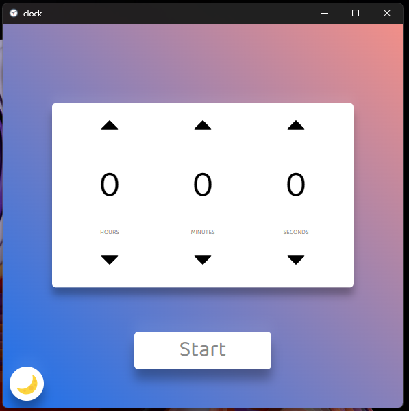
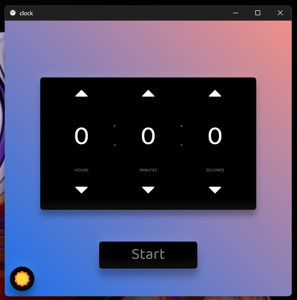
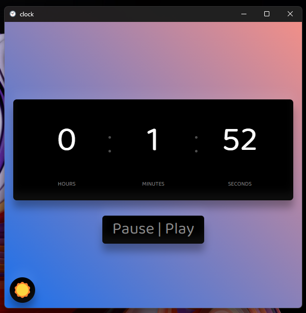

# clock Desktop App





## Setup
``` powershell
npm install
npm start
```

## versions
[CHNAGELOG](./CHANGELOG.md)

## install for windows
Download and run the latest version<br>
password of installer: Azeiynali

## install for linux
This program is not yet available for Linux
